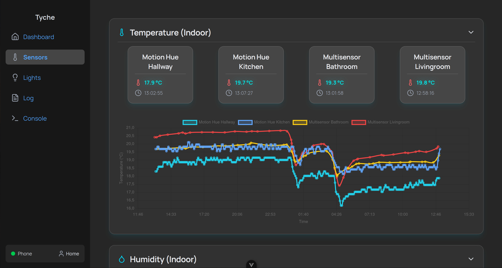
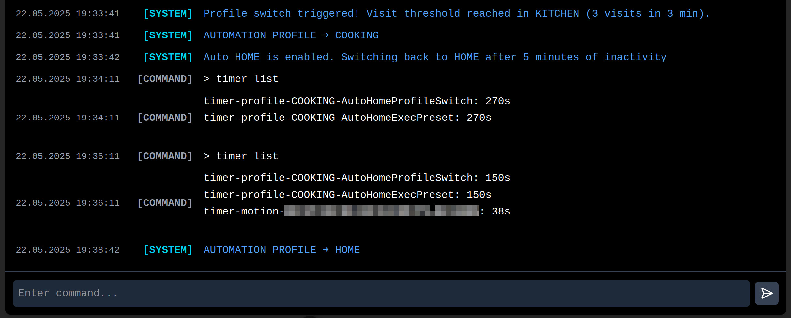
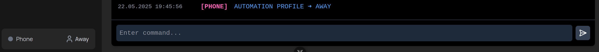
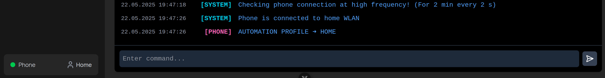
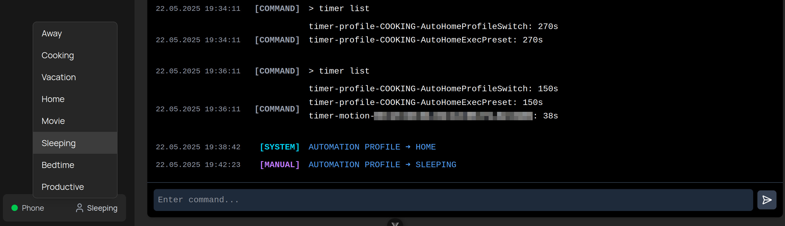
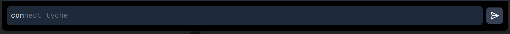
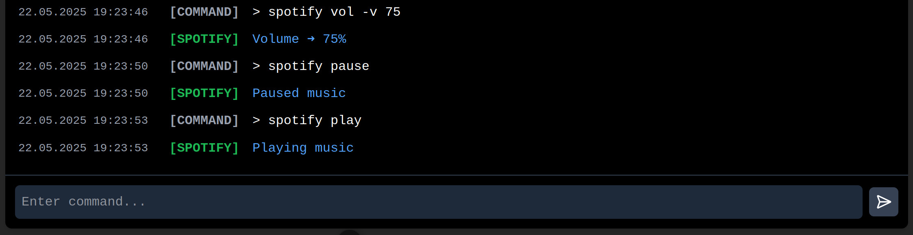
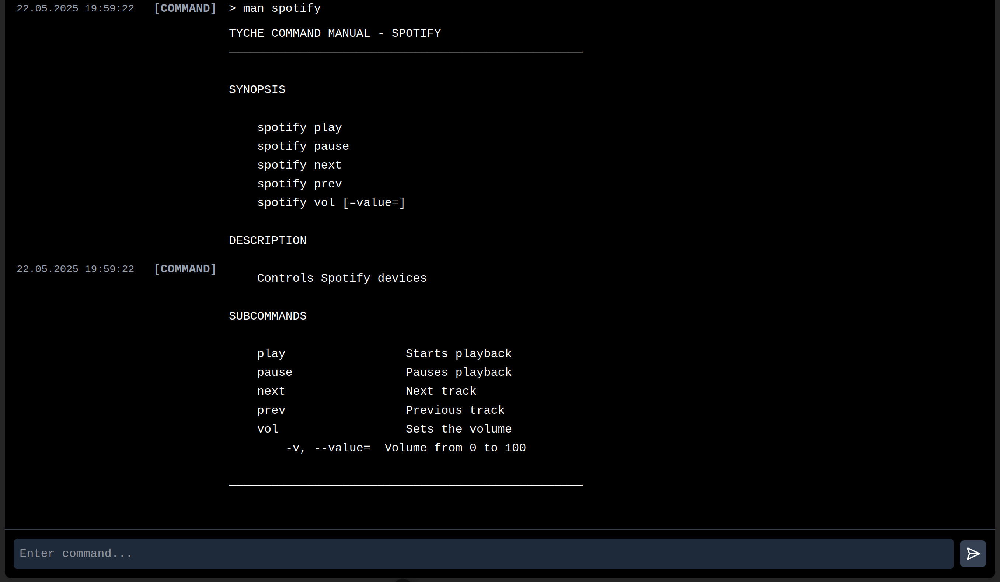

# Tyche Web Interface

A modular web frontend for monitoring and controlling an automation system. It features both a real-time dashboard and an interactive terminal-like console with a custom command parser.

> ⚠️ **Note:** This frontend is not runnable as-is. Configuration files (`/config`) and internal composables (`/composables`) are intentionally excluded from this repository.
> While the [Tyche Backend](https://github.com/Twigman/tyche) is public, it is also not fully operational without private setup.  
> Both repositories are intended for demonstration and review purposes.

## 🔧 Features

- Real-time visualization of sensor data
- Display of mobile device network (Wi-Fi) connection status
- Automation mode control (`Home`, `Away`, `Cooking`, etc.)
- Interactive console with structured command syntax
- Command suggestions (ghost commands) as you type
- Auto-completion with `TAB`
- Command history navigation using arrow keys
- Rich console output with **Markdown formatting**
- Color-coded modules and log levels for better readability
- Communication with backend via REST or WebSocket
- Extensible command parser with options, subcommands, and arguments
- All data (e.g. available automation profiles and sensors) is retrieved from the backend.

## 💡 Example Command Usage

Commands follow a general structure similar to Unix-style CLI:

```
command [subcommand] [--option <value>] [--flag] [argument] ...
```

### Example:
```bash
timer start --duration 30m --label "pasta"
```

> Starts a 30-minute timer labeled “pasta”.

---

## 📦 Supported Commands

```
connect      → Establish connection to backend
disconnect   → Terminate connection
help         → Display general help overview
man          → Show manual for a specific command
spotify      → Control music playback (for testing purposes)
timer        → Start, stop, and manage timers
```

---

## 🛠️ Technologies Used

- [Vue.js 3](https://vuejs.org/)
- [Tailwind CSS 4](https://tailwindcss.com/)
- [Chart.js](https://www.chartjs.org/)
- [Lucide-Vue](https://lucide.dev/icons)
- TypeScript

---

## 📸 Screenshots

### Sensor Dashboard
A real-time overview of all connected sensors with chart visualizations.


---

### Timer Command + Auto Profile Switching
Demonstrates CLI usage to list timers and automatically switch profiles based on timed events.


---

### Phone Connectivity Integration
- When phone disconnects:
  
- When phone reconnects (triggered by hallway motion detection):
  

---

### Profile Selection
Manual profile switching via dropdown menu.


---

### CLI Ghost Commands
Shows predictive command suggestions while typing.


---

### Spotify Control & Command Documentation
- Send music control commands through the CLI.
  
- View a detailed example manual for the `spotify` command.
  
- Command manuals (`man`) are rendered dynamically from the underlying [command schema](./src/types/ConsoleCommand.ts), such as:
```ts
spotify: {
  cmd: 'spotify',
  description: 'Controls Spotify devices',
  subcommands: {
    play: { name: 'play', description: 'Starts playback' },
    pause: { name: 'pause', description: 'Pauses playback' },
    next: { name: 'next', description: 'Next track' },
    prev: { name: 'prev', description: 'Previous track' },
    vol: {
      name: 'vol',
      description: 'Sets the volume',
      requiresOption: true,
      options: {
        value: {
          name: 'value',
          alias: 'v',
          requiresValue: true,
          valueHint: 'number',
          description: 'Volume from 0 to 100',
        },
      },
    },
  },
},
```

---

## 🔗 Related Repositories

- [Tyche Backend](https://github.com/Twigman/tyche)

