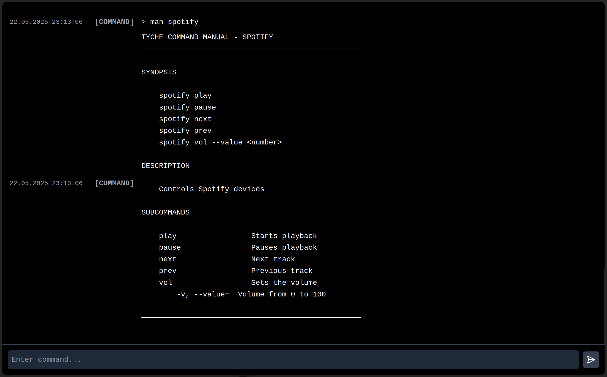

# Tyche Web Interface

A modular web frontend for monitoring and controlling an automation system. It features both a real-time dashboard and an interactive terminal-like console with a custom command parser.

## 🔧 Features

- Real-time visualization of sensor data
- Display of mobile device network (Wi-Fi) connection status
- Automation mode control (`Home`, `Away`, `Cooking`, etc.)
- Interactive console with structured command syntax
- Command suggestions (ghost commands) as you type
- Auto-completion with `TAB`
- Command history navigation using arrow keys
- Rich console output with **Markdown formatting**
- Color-coded modules and log levels for better readability
- Communication with backend via REST or WebSocket
- Extensible command parser with options, subcommands, and arguments

## 💡 Example Command Usage

Commands follow a general structure similar to Unix-style CLI:

```
command [subcommand] [--option <value>] [--flag] [argument1] [argument2] ...
```

### Example:
```bash
timer start --duration 30m --label "pasta"
```

> Starts a 30-minute timer labeled “pasta”.

---

## 📦 Supported Commands

```
connect      → Establish connection to backend
disconnect   → Terminate connection
help         → Display general help overview
man          → Show manual for a specific command
spotify      → Control music playback
timer        → Start, stop, and manage timers
calc         → Perform calculations (e.g. nutrition data)
```

---

## 🛠️ Technologies Used

- [Vue.js 3](https://vuejs.org/)
- [Tailwind CSS 4](https://tailwindcss.com/)
- [Chart.js](https://www.chartjs.org/)
- [Lucide-Vue](https://lucide.dev/icons)
- TypeScript

---

## 🚀 Getting Started

```bash
git clone https://github.com/twigman/tyche-web-interface
cd tyche-web-interface
yarn install
yarn dev --mode development
```

---

## 📸 Screenshots

### Sensor Dashboard


### CLI Timer and auto profile


### CLI Phone Integration


### CLI Profile Selection


### CLI Spotify + Man



### CLI Ghost Commands


---

## 🔗 Related Repositories

- [Tyche Backend](https://github.com/Twigman/tyche)

